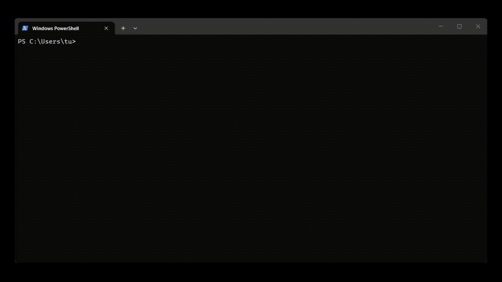

<p align="center">
  
</p>

<h2 align="center">Pragma</h2>

<p align="center">
  <em>A local agent with a memory that forgets.</em>
</p>

<p align="center">
  Your machine  ·  Open models  ·  No API key  ·  A terminal you can live in
</p>

<p align="center">
  <a href="./LICENSE"></a>
  
  
  
</p>

<p align="center">
  
</p>

---

Pragma runs on your machine, against a model you serve yourself, and **remembers
between sessions** — not by keeping a transcript, but by writing down what
happened, distilling what recurs, and letting the rest fade. Come back after a
month and it tells you what it still holds and what has gone quiet.

*From the Greek pragma — something accomplished through action.*

---

## Install

```bat
git clone https://github.com/homoagens/pragma.git
cd pragma
.\install.ps1
```

## Run

Open a **new** terminal — the one that ran the installer has not read your
profile yet — and type:

```bat
pragma
```

That is the whole interface. It opens on **open project · new project · quit**;
make one, and `/configure` points it at your model. `/help` lists the rest.

---

## Requirements

Windows, and **Python 3.10 or newer** installed system-wide. The installer
builds Pragma its own environment, so nothing is added to that Python.

You also need a model being served on an **OpenAI-compatible endpoint** —
[llama.cpp](https://github.com/ggml-org/llama.cpp/releases), LM Studio, Ollama
or vLLM. Everything here is developed against **Qwen3.6 27B · Q5** on
llama.cpp, with `-np 2` so a background consolidation never blocks your turn.

---

## Projects

A project is **one folder you work in** plus **a memory of its own**. `new
project` on the home screen makes one, and `/new` does the same from inside a
conversation.

The folder is the workspace: the agent reads and writes there. The memory lives
apart, under `~/.pragma/projects/<name>` — never inside your folder, because a
workspace is often a git repository and personal episodes have no business in
one.

**`PRAGMA.md`** in the workspace is the other half. Memory is what the agent
*learns*; that file is what you *decide*, and a rule written there always
applies, on every task, without competing with anything the agent remembers.

---

## The memory

Every session that was worth keeping becomes an **episode** — what you were
doing, what happened, what it seems to mean. What recurs across episodes is
distilled into **beliefs**, each carrying the episodes it rests on.

**It forgets on purpose.** An episode's salience decays with the time since it
was last recalled; below a threshold it goes dormant — out of the way, not
deleted — and comes back when a question matches it again. Nothing is destroyed
by default.

**And it changes its mind.** Later experience can rewrite what an old episode
*means* while the record of what happened stays frozen. A belief that
accumulates contradictions is reformulated rather than merely dropped.

---

## GUI

A browser interface exists and still runs:

```bat
.\pragma-gui.bat
```

It opens at `http://localhost:8006`. **In development and behind the terminal:**
it predates the harness and has not been kept up with it, so treat it as a
preview rather than a second way to work.

---

## Research artifacts

*Coming when the paper is public.*

---

## Part of Homo Agens

Pragma is the first public project under
**[Homo Agens](https://github.com/homoagens)**, an open-source effort on
autonomous agents, local inference, and a simple thesis:

> The model matters less than the architecture around it.
> Memory, tools, transparency and execution control are what turn an LLM into
> something that gets things done.

---

## Contact

If you work on agents, local AI, or developer experience — let's talk.

<p>
  <a href="mailto:homoagens1@gmail.com"></a>
  <a href="https://x.com/homoagens1"></a>
  <a href="https://www.reddit.com/user/HomoAgens1/"></a>
</p>

---

## License

[AGPL-3.0-or-later](./LICENSE) — free to use, study, modify and share. If you
distribute a modified Pragma, or offer it to others as a service, you must
release your changes under the same license. Take freely, give back freely.

Versions up to commit `12e94d8` (2026-07-12) were published under the MIT
license.
