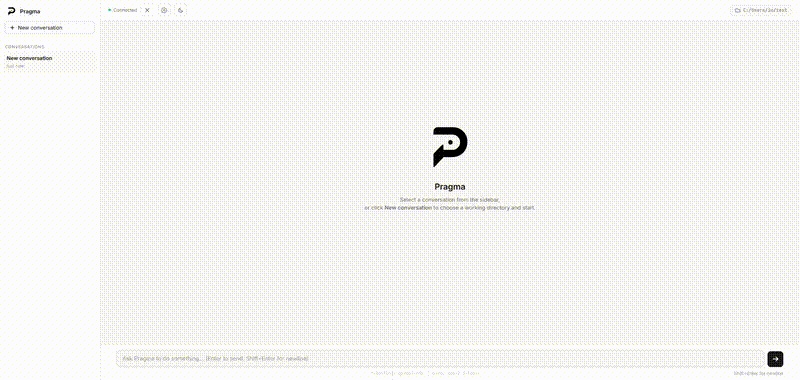

<p align="center">
  
</p>

<h2 align="center">Pragma</h2>

<p align="center">
  <em>A local-first autonomous agent you can actually understand.</em>
</p>

<p align="center">
  Open-source models  ·  Visible reasoning loop  ·  No black boxes  ·  No API key required
</p>

<p align="center">
  <a href="https://github.com/homoagens/pragma/blob/main/LICENSE">
    
  </a>


</p>

<p align="center">
  
</p>

---

Most AI agents are cloud-dependent black boxes. **Pragma runs** entirely **on your machine**, uses **open-source models** served by **llama.cpp**, and streams every reasoning step live in the UI as it happens. You see the thinking, the tools, the observations — nothing hidden.

*From the Greek pragma — something accomplished through action.*

---

## ✦ What makes it different

**🏠 Everything runs locally.**
llama.cpp, your models, your files. No data leaves your machine. No account, no API key, no vendor.

**🔍 The reasoning loop is visible.**
Every thought, action, and observation streams live in the UI. Watch the agent plan, execute, and react — step by step, in real time.

**🧠 Two models, two jobs.**
Pragma routes code generation to a dedicated coding model while a lighter model handles reasoning and orchestration. Better output without forcing one model to do everything.

**📐 Plain, readable stack.**
FastAPI · Vanilla JS · WebSocket. No framework magic. Every file is understandable in isolation.

---

## ⚡ Quickstart

You need three things, in order:

1. **Python 3.10+**
2. **A running `llama.cpp` server** with a model loaded (one terminal, kept open)
3. **Pragma** (another terminal, points to llama.cpp)

The rest of this section walks you through each step. If you've never used `llama.cpp` before, see [§ Don't know llama.cpp?](#-dont-know-llamacpp) further down — there's a ready-to-paste prompt that asks any LLM to generate the install + launch commands for your specific OS and hardware.

---

### 1. Install Pragma

```bash
git clone https://github.com/homoagens/pragma
cd pragma
```

```bat
install.bat          :: Windows
```

```bash
chmod +x install.sh start.sh && ./install.sh    # Linux / macOS
```

---

### 2. Run a model with llama.cpp

Download a prebuilt binary from [github.com/ggml-org/llama.cpp/releases](https://github.com/ggml-org/llama.cpp/releases) (CUDA for NVIDIA, Vulkan for AMD/Intel, AVX2 for CPU-only).

This is the **reference setup** used to develop Pragma — Qwen 3.6 35B A3B (MoE) with full 128k context, tight 12 GB VRAM budget thanks to MoE expert offloading and 4-bit KV cache:

```bash
llama-server \
    -hf bartowski/Qwen_Qwen3.6-35B-A3B-GGUF \
    -hff Qwen_Qwen3.6-35B-A3B-Q5_K_M.gguf \
    --mmproj /path/to/qwen36-35b-a3b-mmproj-f16.gguf \
    --port 8091 \
    -ngl 999 \
    -ncmoe 27 \
    -c 131072 \
    -ctk q4_0 \
    -ctv q4_0 \
    --flash-attn on \
    -t 16 \
    --no-mmap \
    --jinja
```

The notable flags:
- `-c 131072` — full 128k context window. Must match `CONTEXT_WINDOW` in `.env`.
- `-ctk q4_0 -ctv q4_0` — 4-bit KV cache. Halves VRAM with no measurable quality loss.
- `-ncmoe 27` — keeps 27 MoE expert layers on CPU (and host RAM) so the model fits in tight VRAM. Drop this if you have ≥ 24 GB VRAM.
- `-ngl 999` — push every non-offloaded layer to GPU.
- `--jinja` — required for Qwen3's chat template.

Smaller hardware? Same `llama-server` binary, just swap the model:
- 16 GB VRAM → Qwen 14B Q4_K_M, no `-ncmoe`
- 8 GB VRAM → Llama 3.1 8B Q4_K_M
- CPU only → Qwen 2.5 7B Q4_K_M

Verify the server is up:

```bash
curl http://127.0.0.1:8091/v1/models
```

---

### 3. Point Pragma at it

```bash
cp .env.example .env
```

Edit `.env`:

```env
LLM_PROVIDER=openai
LLM_BASE_URL=http://127.0.0.1:8091/v1
LLM_API_KEY=
DEFAULT_MODEL=Qwen_Qwen3.6-35B-A3B-Q5_K_M    # use the name llama-server reports
CODING_PROVIDER=openai
CODING_BASE_URL=http://127.0.0.1:8091/v1
CODING_MODEL=Qwen_Qwen3.6-35B-A3B-Q5_K_M
CONTEXT_WINDOW=131072
MAX_TOKENS=32768
```

Start Pragma:

```bat
start.bat       :: Windows
./start.sh      # Linux / macOS
```

Opens at **http://localhost:8006**. The settings panel in the UI shows the active `.env` entries (sensitive values masked) and lets you reload the config without restarting.

---

## 🤖 Don't know llama.cpp?

You don't actually need to learn llama.cpp's flags from scratch. Paste the following prompt into any LLM (Claude, ChatGPT, Gemini, even a local model) and it will produce **OS-specific install commands plus a tuned `llama-server` invocation for your exact hardware**.

```
I need to run llama.cpp locally as the inference backend for an OpenAI-compatible
HTTP API (it will be consumed by an agent framework called Pragma).

Tell me, step by step:

1. How to download and install the right prebuilt llama.cpp binary for my OS
   and GPU vendor from https://github.com/ggml-org/llama.cpp/releases (CUDA for
   NVIDIA, Vulkan for AMD/Intel, AVX2/AVX512 for CPU only). Give me the exact
   filename to download.

2. Which GGUF model to download for my hardware. Recommend a sensible
   default from bartowski's collection on Hugging Face for my VRAM/RAM budget,
   and give me the direct download link. Prefer Qwen3 MoE for ≥16 GB VRAM,
   smaller dense models otherwise.

3. The full `llama-server` command to launch it, with appropriate flags for:
     - context window appropriate for the model
     - GPU offloading (-ngl)
     - MoE expert offloading (-ncmoe) if the model is MoE and VRAM is tight
     - KV cache quantization (-ctk / -ctv) if memory is tight
     - flash attention (--flash-attn on)
     - threads (-t) = my CPU physical core count
     - --jinja for chat template handling on Qwen-family models
   The server must listen on port 8091.

4. A curl command to verify the server is responding on /v1/models.

5. The .env values I should put in Pragma:
     LLM_PROVIDER=openai
     LLM_BASE_URL=http://127.0.0.1:8091/v1
     DEFAULT_MODEL=<the name llama-server reports for the loaded model>
     CONTEXT_WINDOW=<same value used with -c in the server>
     MAX_TOKENS=<sensible output cap, typically context/4>

My hardware:
- OS: <Windows 11 / Ubuntu 24.04 / macOS 14 / ...>
- GPU: <NVIDIA RTX 4070 12GB / AMD RX 7900 24GB / no discrete GPU / ...>
- RAM: <32 GB / 64 GB / ...>
- CPU: <model + physical core count>

Be concrete: filenames, full commands, expected output. No prose, no theory.
```

Fill in the four hardware lines at the bottom and you get a ready-to-run setup. Pragma is unchanged regardless of what the LLM produces — the contract is just "an OpenAI-compatible server on port 8091".

---

## 🔌 Cloud providers

Pragma can also talk to a hosted endpoint instead of a local server. Less tested, but it works.

<details>
<summary><strong>OpenAI / OpenAI-compatible APIs</strong> (Groq, Mistral, OpenRouter, DeepSeek, …)</summary>

```env
LLM_PROVIDER=openai
LLM_BASE_URL=https://api.openai.com/v1   # or any compatible endpoint
LLM_API_KEY=sk-...
DEFAULT_MODEL=gpt-4o-mini
```

</details>

<details>
<summary><strong>Anthropic</strong></summary>

```env
LLM_PROVIDER=anthropic
LLM_API_KEY=sk-ant-...
DEFAULT_MODEL=claude-haiku-4-5
```

</details>

---

## 🖥 Reference hardware

The setup above is tested daily on:

| Component | Tested on |
|---|---|
| GPU VRAM | NVIDIA RTX A2000 12 GB |
| System RAM | 128 GB |
| CPU | Intel Xeon Silver 4314 (32 cores, 16 threads used via `-t 16`) |

Notes:
- The 12 GB VRAM holds the active MoE experts, the (q4\_0) KV cache, and the vision projector.
- The 128 GB RAM is what makes `-ncmoe 27` viable — 27 MoE expert layers stay on CPU and stream in as needed.
- CPU-only is possible with smaller / more quantized models, just slow.
- More VRAM → drop `-ncmoe` for a substantial speedup.

---

## 🗂 Architecture

```
pragma/
  agent/          FastAPI server · ReAct orchestration · skill wrappers
  core/           LLM client · memory compression · skill palette
  interface-web/  Vanilla JS + WebSocket UI — no build step
```

**`core/`** — provider-agnostic, reusable:

| File            | Role                                                   |
| --------------- | ------------------------------------------------------ |
| `llm_client.py` | Dispatches to OpenAI-compatible or Anthropic endpoints |
| `agent.py`      | Generic ReAct loop with streaming `on_step` callback   |
| `memory.py`     | Transparent context compression as conversations grow  |
| `skills/`       | One folder per skill — filesystem, shell, web, LLM, code… |

**`agent/`** — Pragma-specific behavior on top of core:

- Per-thread working directory, concurrency-safe
- Thread persistence on disk as JSON
- WebSocket streaming with async/thread bridging

---

## 🌱 Part of Homo Agens

Pragma is the first public project under **[Homo Agens](https://github.com/homoagens)** — an open-source effort exploring autonomous agents, local inference, and a simple thesis:

> The model matters less than the architecture around it.  
> Memory, tools, transparency, and execution control are what turn an LLM into something that actually gets things done.

---

## 📬 Contact

If you work on agents, local AI, open-source tooling, or developer experience — let's talk.

[Email](mailto:homoagens1@gmail.com) &nbsp;·&nbsp; [X / Twitter](https://x.com/homoagens1)

---

## License

[MIT](./LICENSE)
