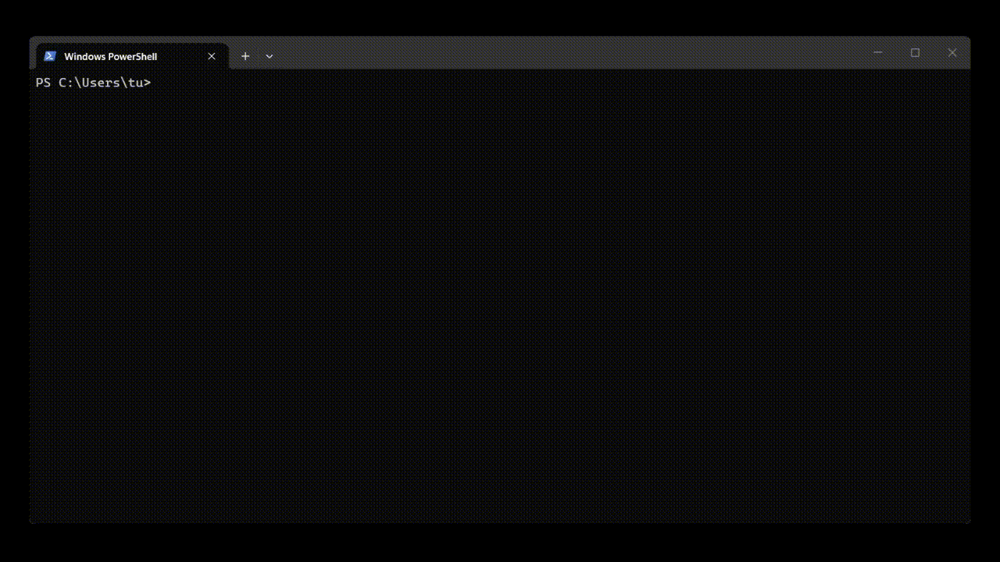

<p align="center">
  
</p>

<h2 align="center">Pragma</h2>

<p align="center">
  <em>A local agent with a memory that forgets.</em>
</p>

<p align="center">
  Your machine  ·  Open models  ·  No API key  ·  A terminal you can live in
</p>

<p align="center">
  <a href="./LICENSE"></a>
  
  
  
</p>

<p align="center">
  
</p>

---

Pragma runs on your machine, against a model you serve yourself, and **remembers
between sessions** — not by keeping a transcript, but by writing down what
happened, distilling what recurs, and letting the rest fade. Come back after a
month and it tells you what it still holds and what has gone quiet.

*From the Greek pragma — something accomplished through action.*

---

## Install

**Linux and macOS**

```bash
git clone https://github.com/homoagens/pragma.git
cd pragma
./install.sh
```

**Windows**

```bat
git clone https://github.com/homoagens/pragma.git
cd pragma
.\install.ps1
```

## Run

Open a **new** terminal — the one that ran the installer has not read your
profile yet — and type:

```bash
pragma
```

That is the whole interface, and it is **two screens**.

**Home** says what your model is serving and whether it answers, lists your
recent projects, names any memory still being written, and takes `/open`,
`/new`, `/projects`, `/jobs`, `/configure` and `/exit`. `/open` goes straight
back into a project by name. `/projects` is everything done *to* a project —
open one, start one, snapshot or restore its memory, remove it — and
`/configure` points Pragma at your endpoint, giving each role its own if you
want. On a machine with no projects yet the page offers `/new` and little
else.

**A project** opens on a briefing — what your memory holds, what changed while
you were away, what wants attention — and then you talk. What is there is what
belongs to *this* project: `/memory` to look at the store, `/settings` for what
it decides for itself, `/status` for how it is set up, plus `/jobs`, `/help`
and `/configure` — an endpoint that dies mid-turn is worth fixing without
leaving. **ctrl+D** closes the project and hands the conversation to the
memory; a second one, at home, leaves.

While a turn runs you watch it happen: one status block that says who is
working and for how long, the model's reasoning wrapped and scrolling under it
while it lasts, each tool call with its output folded to a few lines, and a
last line counting the steps, the tools and the seconds. The reasoning goes
when it is over. The answer stays.

---

## Requirements

Linux, Windows or macOS, and **Python 3.10 or newer** installed system-wide.
The installer builds Pragma its own environment, so nothing is added to that
Python. (On Debian and Ubuntu, `sudo apt install python3-venv` first: they
ship the standard library without the part that builds one.)

**Pragma is developed in the terminal on Linux, and everything is tested
there.** That is the interface this page and the documentation describe, and
where new work lands first.

- **Windows** has the same two screens, run from PowerShell. It is brought
  into line with Linux after each round of changes, so it can be a step
  behind.
- **macOS** runs the Linux launcher, and is not what Pragma is tested on.
- **The browser interface** is the old one: see [below](#the-browser-interface).

A memory written on one system can be read on another.
[Three interfaces, and where each stands](docs/explanation/interfaces.md)
lists what differs between them.

You also need a model being served on an **OpenAI-compatible endpoint** —
[llama.cpp](https://github.com/ggml-org/llama.cpp/releases), LM Studio, Ollama
or vLLM. Everything here is developed against **Qwen3.6 35B-A3B · Q5** on
llama.cpp, with a 131072-token context and one slot (`-c 131072 -np 1`). With
one slot, a consolidation running in the background and your next turn wait
for each other; `-np 2` lets them run side by side, each with half the
context.

---

## Projects

A project is **one folder you work in** plus **a memory of its own**. `/new`
on the home screen makes one: it asks for a name and a folder, and nothing
else.

The folder is the workspace: the agent reads and writes there. The memory lives
apart, under `~/.pragma/projects/<name>` — never inside your folder, because a
workspace is often a git repository and personal episodes have no business in
one.

**`PRAGMA.md`** in the workspace is the other half. Memory is what the agent
*learns*; that file is what you *decide*, and a rule written there always
applies, on every task, without competing with anything the agent remembers.

**What the endpoint decides** is what the model is, and it is set once for the
whole machine in `/configure`: whether it reasons, which of the roles — the
agent's steps, the recall, the memory faculties — are asked to use that
reasoning, and the sampling numbers each of them travels with. They belong to
the server because the server is running the model, and every project talking
to it inherits them.

**What each project decides for itself** is how many steps a turn may take,
asked by `/settings` and kept with the project. A project can also carry its
own context window, its own budgets and its own limits on what is recalled:
the [configuration reference](docs/reference/configuration.md) marks which
settings those are. They live in the registry, not in the repository, so two
projects on one machine can disagree.

---

## The memory

Every session that was worth keeping becomes an **episode** — what you were
doing, what happened, what it seems to mean. What recurs across episodes is
distilled into **beliefs**, each carrying the episodes it rests on.

**It forgets on purpose.** An episode's salience decays with the time since it
was last recalled; below a threshold it goes dormant — out of the way, not
deleted — and comes back when a question matches it again. Nothing is destroyed
by default.

**And it changes its mind.** Later experience can rewrite what an old episode
*means* while the record of what happened stays frozen. A belief that
accumulates contradictions is reformulated rather than merely dropped.

**It writes while you carry on.** Turning a conversation into episodes takes a
minute of thinking, so it happens in the background: **ctrl+D** gives you the
terminal back at once and the memory finishes on its own — in its own process,
so closing the conversation never interrupts it. `/jobs` follows it live, from
inside a project or from the home screen, and names the faculty at work: the
segmenter deciding what was worth keeping, the consolidator writing the
episode, the abstractor distilling beliefs. The next briefing says whether
anything is still being written, and the way out holds once to tell you so.

---

## Documentation

**<https://homoagens.github.io/pragma/>** has the rest, with a menu and a
search; the same pages are in [`docs/`](docs/README.md). Start with [your
first project](docs/tutorial/first-project.md), ten minutes from an empty
screen to a memory that came back. Then there are guides for single tasks — connecting
a model, writing rules the agent must follow, moving a project — every
[command](docs/reference/commands.md) and every
[setting](docs/reference/configuration.md) with its default, and [how Pragma
is put together](docs/explanation/architecture.md), with which file does
what.

---

## The browser interface

A browser interface exists and still runs. From the folder Pragma is
installed in:

```bash
venv/bin/python -m agent.run
```

or `.\pragma-gui.bat` on Windows. It opens at `http://localhost:8006`.

**It is the old interface, and it is not being worked on for now.** It
predates the terminal and has not followed it: it has threads instead of
projects, it does not read a project's `PRAGMA.md`, and it does not write
episodes. Treat it as a view of an earlier Pragma rather than a second way to
work.

---

## Research artifacts

*Coming when the paper is public.*

---

## Part of Homo Agens

Pragma is the first public project under
**[Homo Agens](https://github.com/homoagens)**, an open-source effort on
autonomous agents, local inference, and a simple thesis:

> The model matters less than the architecture around it.
> Memory, tools, transparency and execution control are what turn an LLM into
> something that gets things done.

---

## Contact

If you work on agents, local AI, or developer experience — let's talk.

<p>
  <a href="mailto:homoagens1@gmail.com"></a>
  <a href="https://x.com/homoagens1"></a>
  <a href="https://www.reddit.com/user/HomoAgens1/"></a>
</p>

---

## License

[AGPL-3.0-or-later](./LICENSE) — free to use, study, modify and share. If you
distribute a modified Pragma, or offer it to others as a service, you must
release your changes under the same license. Take freely, give back freely.
