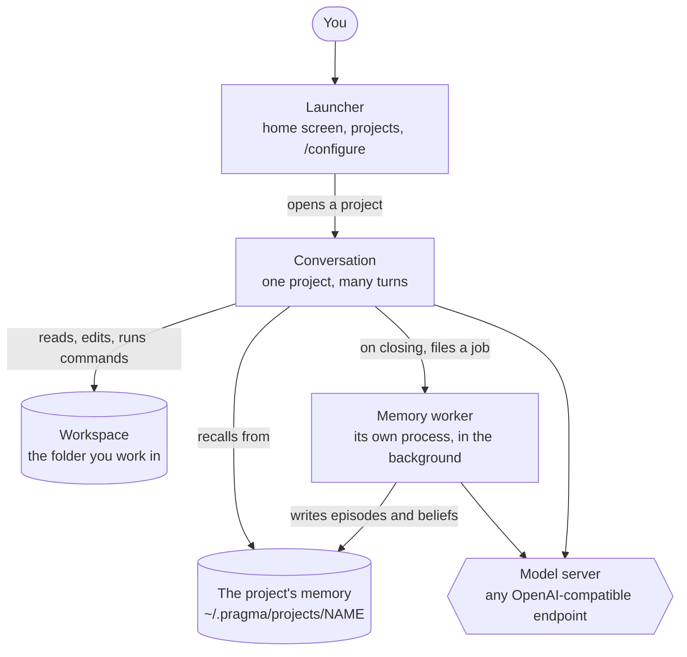

# Architecture

What the pieces of Pragma are, what happens between a line you type and the
answer, and which file does what. This page says *where*. The reasons are in
two places: the larger choices in the [decisions](../decisions/README.md),
the smaller ones at the top of the file that implements them.

## The pieces

Pragma is not one program that stays running. It is three kinds of process,
two places on disk, and a model server that is yours.

- **The launcher** is the home screen. It knows the projects, opens one, and
  owns `/configure`. It never calls the agent itself.
- **The conversation** is one project, open. It is started by the launcher as
  a separate process and ends when you close the project.
- **The memory worker** turns a finished conversation into memory. It is
  started when the conversation closes and outlives it, which is why closing
  a project gives the terminal back at once.
- **The workspace** is your folder. The agent reads and writes there.
- **The project's memory** lives apart from the workspace, under your home
  folder, so that nothing personal ends up in a repository.
- **The model server** is not part of Pragma. Anything that speaks the OpenAI
  chat API will do; Pragma is developed against llama.cpp.

## What happens in a turn

1. **You type a line.** One that starts with `/` is a
   [command](../reference/commands.md) and never reaches the model.
2. **Recall.** [`core/curator.py`](../../core/curator.py) gathers candidates
   from the project's memory and one model call chooses which are worth
   showing. What it chose is placed in front of your message.
3. **The request is put together.** The system prompt was built when the
   project opened, from [`agent/prompts.py`](../../agent/prompts.py) and the
   workspace's `PRAGMA.md` if there is one; [Prompts](../reference/prompts.md)
   lists its parts. After it come the conversation so far and your message.
   The [skills](../reference/skills.md) are offered to the model as tools.
4. **The loop.** [`core/react.py`](../../core/react.py) calls the model. The
   reply is either a tool call or the answer. A tool call runs the skill, what
   it returned goes back to the model, and the loop repeats until there is an
   answer or the step budget runs out.
5. **The answer is drawn**, and the turn is appended to a transcript on disk
   before anything else can fail.

Three things watch the loop while it runs:

- Before a skill writes to a file, [`core/checkpoint.py`](../../core/checkpoint.py)
  keeps the version that was there, so `revert` can put it back.
- A model that repeats its own reasoning, or the same failing call, is
  stopped or told to change approach.
- When the steps of a long turn approach the context window, the older ones
  are summarised by [`core/memory.py`](../../core/memory.py).

Two optional faculties sit at the end of a turn, both off unless turned on in
`/configure`: a check of the work against the request
([`core/critic.py`](../../core/critic.py)), and a guess at the line you will
type next ([`core/suggest.py`](../../core/suggest.py)).

[`agent/harness.py`](../../agent/harness.py) is what all of this looks like
on screen while it happens.

## What happens when you close a project

The conversation files a job and exits. The memory worker picks it up:

1. [`core/segmenter.py`](../../core/segmenter.py) decides which turns were
   worth keeping.
2. [`core/skills/episode_consolidate/`](../../core/skills/episode_consolidate/README.md)
   writes an episode for each of them. The three steps below run from there,
   once per episode written.
3. [`core/episodes.py`](../../core/episodes.py) moves episodes that have
   faded into the dormant zone.
4. [`core/reconsolidate.py`](../../core/reconsolidate.py) may revise what
   related earlier episodes are taken to mean.
5. Beliefs are distilled from what recurs across episodes, and a belief that
   has been contradicted often enough is reworded.

The job is a file. A worker that dies leaves it behind with the turns still
inside, `/jobs` shows it, and it can be
[run again](../how-to/recover-unfinished-memory.md). A conversation that
grows too long for the context window goes through the same steps for its
older turns, without closing.

## Which server answers which call

No part of the code names a server. Every model call goes through
[`core/llm_client.py`](../../core/llm_client.py) and says only who is asking.
[`core/endpoints.py`](../../core/endpoints.py) turns that into one of four
roles — `agent`, `recall`, `memory`, `critic` — and the catalogue written by
`/configure` says which endpoint serves each role, whether it reasons, and
how it samples. With one endpoint, it serves all four.

## The ways in

| Way in | Start it with | Entry point | Where it stands |
|---|---|---|---|
| The terminal on Linux | `pragma` | [`tools/pragma_launcher.py`](../../tools/pragma_launcher.py), then [`agent/chat.py`](../../agent/chat.py) | where Pragma is developed and tested |
| The terminal on Windows | `pragma`, in PowerShell | [`tools/Pragma.psm1`](../../tools/Pragma.psm1), then [`agent/chat.py`](../../agent/chat.py) | follows Linux |
| One task, no interaction | `python -m agent.batch --task "..." --cwd DIR` | [`agent/batch.py`](../../agent/batch.py) | the same code everywhere |
| The browser | `python -m agent.run` | [`agent/run.py`](../../agent/run.py), then [`agent/server.py`](../../agent/server.py) and [`interface-web/`](../../interface-web) | the old interface, not being worked on |

The first three run the same loop, the same skills and the same memory. The
browser interface runs the same loop and the same skills and has not followed
the rest: it does not read `PRAGMA.md`, and it does not write episodes.
[Three interfaces, and where each stands](interfaces.md) has what differs
between them.

## Where state lives

The short version. [Files](../reference/files.md) has what is inside each.

| What | Where | Who writes it |
|---|---|---|
| The projects: name, folder, settings | `~/.pragma/registry.json` | the launcher |
| The endpoints, the roles, the optional faculties | `~/.pragma/endpoints.json` | `/configure` |
| A project's episodes | `~/.pragma/projects/NAME/episodes/`, with `dormant/` inside it | the memory worker |
| A project's beliefs | `~/.pragma/projects/NAME/learnings.json` | the memory worker |
| Memory work in flight, or that failed | `~/.pragma/projects/NAME/jobs/` | the conversation and the worker |
| Snapshots of a project's memory | `~/.pragma/projects/backups/NAME/`, or `~/.pragma/backups/NAME/` on Windows | `/projects backups` |
| Plugins of the home screen | `~/.pragma/plugins/NAME/plugin.json` | you |
| [Rules](../how-to/write-project-rules.md) the agent must follow in a project | `PRAGMA.md` in the workspace | you; the agent is refused |
| What was said in every conversation held there | `.pragma_session.jsonl` in the workspace | the conversation |
| Undo copies of edited files | `.pragma_checkpoints/` in the workspace | the loop |
| Defaults for the whole machine | `.env` in the repository | you |
| Threads of the browser interface | `~/.pragma/threads/` | the server |

## Code map

### `core/` — the agent and its memory

| File | What it is |
|---|---|
| [`react.py`](../../core/react.py) | The loop: model call, tool call, result, until there is an answer. |
| [`llm_client.py`](../../core/llm_client.py) | Every HTTP call to a model server: streaming, retries, the reasoning watchdog. |
| [`endpoints.py`](../../core/endpoints.py) | Which server answers which role, and the catalogue file that says so. |
| [`config.py`](../../core/config.py) | Every [setting](../reference/configuration.md), read from the environment. |
| [`tool_schema.py`](../../core/tool_schema.py) | Describes the skills as the `tools` a model is offered. |
| [`json_parser.py`](../../core/json_parser.py) | Finds the JSON object in a model's reply. |
| [`checkpoint.py`](../../core/checkpoint.py) | Undo for file edits. |
| [`memory.py`](../../core/memory.py) | Summarises the older steps of a long turn. Not the long-term memory, despite the name. |
| [`curator.py`](../../core/curator.py) | Recall: chooses what memory brings to a turn. |
| [`episodes.py`](../../core/episodes.py) | The episode store: active and dormant zones, fading. |
| [`segmenter.py`](../../core/segmenter.py) | Which turns of a conversation become episodes. |
| [`reconsolidate.py`](../../core/reconsolidate.py) | Revising what stored episodes and beliefs mean. |
| [`clock.py`](../../core/clock.py) | The clock the memory reads. It can be frozen for tests. |
| [`critic.py`](../../core/critic.py) | The optional check of a turn against the request. |
| [`suggest.py`](../../core/suggest.py) | The optional guess at your next line. |
| [`skills/`](../../core/skills) | The tools, one folder each. [`__init__.py`](../../core/skills/__init__.py) is the loader and decides which are offered. |

### `agent/` — the ways of running it

| File | What it is |
|---|---|
| [`chat.py`](../../agent/chat.py) | A live conversation: the turns, the commands, handing over to memory. |
| [`harness.py`](../../agent/harness.py) | What a conversation looks like on screen. |
| [`prompts.py`](../../agent/prompts.py) | The agent's system prompt. |
| [`batch.py`](../../agent/batch.py) | One task, start to finish. |
| [`server.py`](../../agent/server.py) | The server behind the browser interface. |
| [`run.py`](../../agent/run.py) | Starts that server. |

### `tools/` — the screens around a conversation

| File | What it is |
|---|---|
| [`pragma_launcher.py`](../../tools/pragma_launcher.py) | The launcher on Linux and macOS: the registry of projects, opening one. |
| [`Pragma.psm1`](../../tools/Pragma.psm1), [`pragma-session.ps1`](../../tools/pragma-session.ps1) | The same launcher for Windows PowerShell. |
| [`pragma_home.py`](../../tools/pragma_home.py) | The home prompt, its commands, the plugins. |
| [`pragma_configure.py`](../../tools/pragma_configure.py) | The `/configure` pages. |
| [`pragma_menu.py`](../../tools/pragma_menu.py) | The lists walked with the arrows. |
| [`pragma_brief.py`](../../tools/pragma_brief.py) | The briefing shown when a project opens. |
| [`pragma_jobs.py`](../../tools/pragma_jobs.py) | The record of background memory work, and `/jobs`. |
| [`pragma_consolidate.py`](../../tools/pragma_consolidate.py) | The memory worker. |
| [`mem_map.py`](../../tools/mem_map.py) | The views of a memory store behind `/memory`. |
| [`pragma_endpoint.py`](../../tools/pragma_endpoint.py) | Reports what an endpoint serves and how it samples. |
| [`endpoint_monitor.py`](../../tools/endpoint_monitor.py) | A dashboard for model servers. It stands alone and knows nothing of Pragma. |

### The repository root

| File | What it is |
|---|---|
| [`pragma`](../../pragma) | The command on Linux and macOS. |
| [`install.sh`](../../install.sh), [`install.ps1`](../../install.ps1) | Build the Python environment and put `pragma` in every shell. |
| [`start.bat`](../../start.bat) | The terminal interface from a double-click, on Windows. |
| [`pragma-gui.bat`](../../pragma-gui.bat) | The browser interface, on Windows. |
| [`.env.example`](../../.env.example) | The few settings a new installation needs. |
| [`interface-web/`](../../interface-web) | The browser interface: one page, one script, one stylesheet. |
| [`docs/`](../README.md) | These pages, and the program that generates the reference. |
| [`mkdocs.yml`](../../mkdocs.yml) | The menu and the theme of these pages as a site. |
